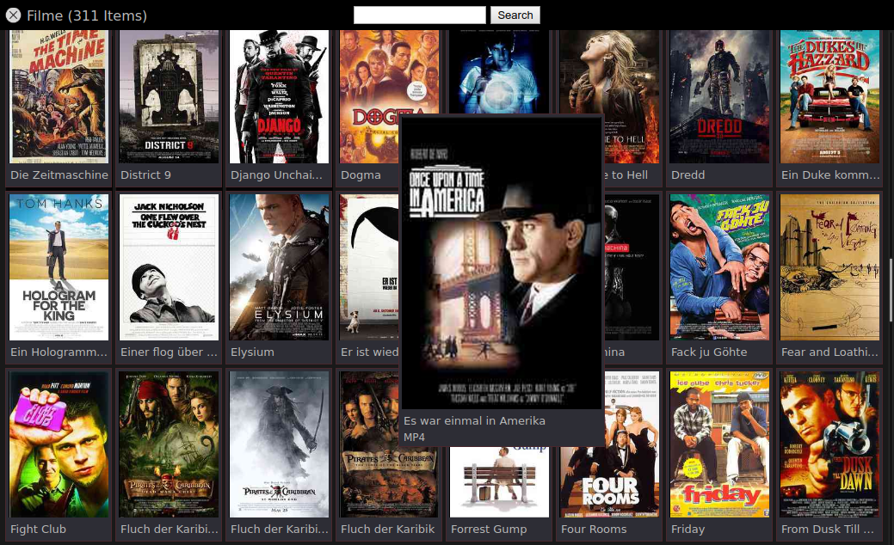

# movie-shelf

Little node script that'll generate a html list of your movie files.

My goal was to have one html file that contains everything needed, including
cover art, and can be opened directly from disk.

You'll need to have ffmpeg installed to get extended video information and
generate thumbnails.

Use ```make-shelf.js -h``` for options.

Click [here](https://daevidpreis.github.io/movie-shelf/) for a demo.

----



----

Only tested on Linux & Google Chrome.
